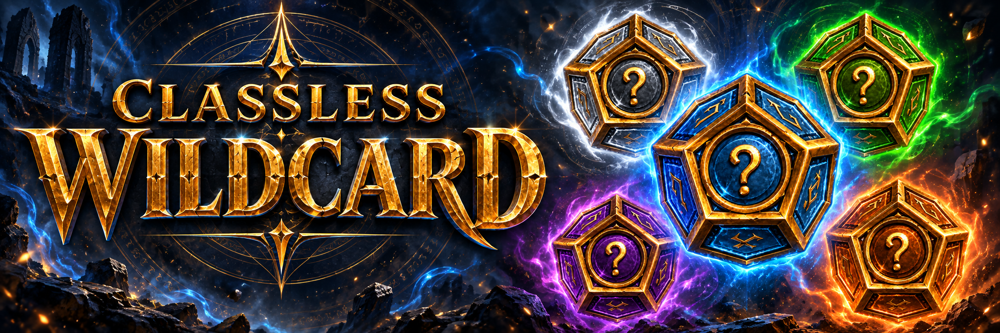
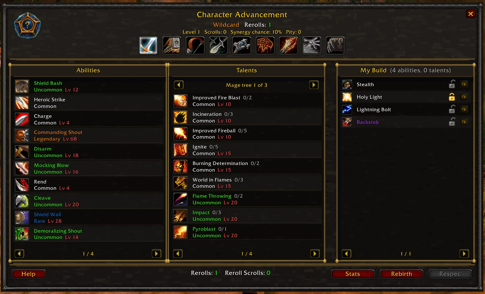
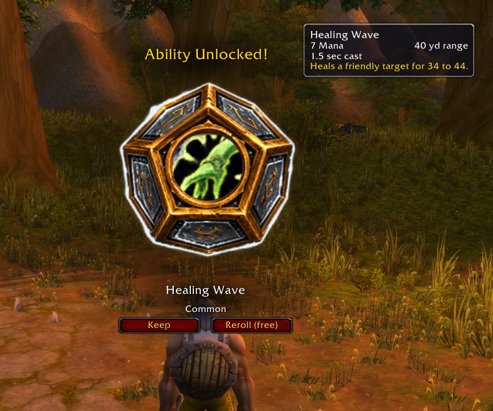
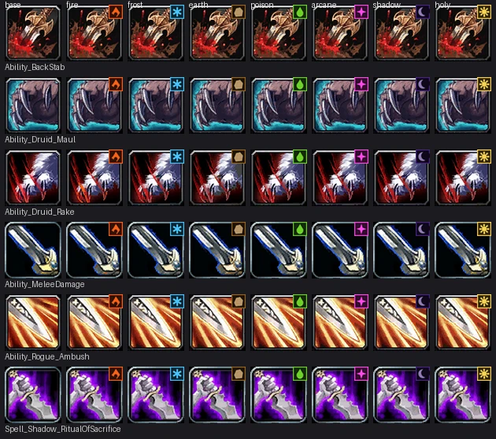

<div align="center">



<br>

[](https://www.azerothcore.org/)
[](https://www.azerothcore.org/)
[](src/)
[](client-addon/)
[](#license)

**Every character can learn every spell and every talent from every class.** Buy them with
Essence, or let the server roll for you in Wildcard mode.

[What it is](#what-it-is) · [Features](#features) · [Install](#installation) · [Playerbots](#playerbots) · [Commands](#commands) · [Configuration](#configuration) · [Wildcard rolls](#how-wildcard-rolls-work) · [Elemental variants](#elemental-variants) · [Uninstall](#uninstall)

</div>

---

> [!CAUTION]
> **This is a total server overhaul, and it is experimental.**
>
> It replaces the class system outright and rebuilds progression, resources, stats, gear and
> quest access around it. Plan a realm around it; do not add it to an existing one you care about.
>
> The [client patch](#client-every-player) is **required**. Every player must run it, or the
> game is broken for them.
>
> Installing changes character data and writes to core tables. It is [reversible](#uninstall),
> but back up your world and characters databases first.

---

## What it is

`mod-classless-wildcard` removes the class system from WotLK 3.3.5a. Every character is a
**Hero**. Character creation offers a race and nothing else. Behind the scenes every Hero runs on
one shared base class that grants no abilities and locks nothing away, so race is the only choice
that carries anything, and it keeps its racial traits. Every ability and every talent is earned in
game and can come from any class.

There are two ways to earn them:

- **Classless.** Buy exactly the abilities and talents you want with Essence, priced by rarity.
- **Wildcard.** The Season 9/10 ruleset from Project Ascension. The server rolls abilities and
  talents on a fixed schedule. Players steer the result with rerolls, ability locks and bad-luck
  protection.

|                       | **Classless** (free pick)                                            | **Wildcard** (rolled)                                             |
| --------------------- | -------------------------------------------------------------------- | ----------------------------------------------------------------- |
| How you gain power    | Spend Ability Essence (AE) and Talent Essence (TE)                   | The server rolls abilities and talents for you                    |
| Starting kit          | 3 AE to spend as you like                                            | 4 random abilities at level 1                                     |
| Progression           | +1 AE per level from 4, +1 TE per level from 10                      | One roll per level from level 10, alternating ability and talent  |
| Cost model            | Abilities cost 1 / 2 / 3 / 5 / 8 AE by rarity, talents 1 TE per rank | Free but weighted. Legendary is rarest, and talent rank is rarity |
| Control over outcomes | Total. Unlearning refunds, and a full respec costs gold              | Rerolls, ability locks, synergy rolls, reroll cooldowns           |
| Changing your mind    | `.classless respec`                                                  | `.wildcard reroll`, Reroll Scrolls, Rebirth                       |

Both paths share the same resources, stats, proficiencies, NPC and addon. Players choose a path
per character, or the realm forces one through config. **Rebirth** switches paths later for gold.

The stock client still renders the class system it was built for, so the **client patch is
required**. It renames every class to Hero, removes the class picker, restores the ranged slot,
and installs the addon that players use to buy abilities and see rolls. See
[Client (every player)](#client-every-player).

---

## Screenshots

<div align="center">



<em>The <b>Character Advancement</b> panel. Browse every class's abilities and talent trees,<br>
with your build on the right. Lock or reroll anything you own from the same window.</em>

<br><br>



<em>A <b>Wildcard</b> roll. The die lands on a new ability and shows its rarity.<br>
Keep it, or spend a reroll.</em>

</div>

---

## Features

### Building a Hero

- **Classless free pick.** Rarity-priced abilities, and talents from every tree bought a rank at
  a time with prerequisites and tier rules enforced. Unlearning refunds essence, a full respec
  costs gold, and owned spell lines rank up automatically as you level.
- **Wildcard rolls.** Free rerolls below level 10, rarity-weighted rolls, ability locking, and
  synergy rolls that favour classes you already own. A talent roll also rolls its rank, and rank
  is rarity: rank 1 is common, rank 5 is legendary, and landing on rank 5 hands you the full
  talent for free. See [How Wildcard rolls work](#how-wildcard-rolls-work).
- **Rerolls.** Every level from 10 grants 3 reroll charges, spent on abilities and talents alike.
  Anything you own can be rerolled later from **My Build**. Reroll Scrolls top the pool up, sold
  by the NPC and the addon at a price that scales with level.
- **Rebirth.** A full reset that also switches paths, available after the mode lock and gated by
  config. A Wildcard rebirth replays the whole roll schedule.
- **Archetypes.** Thirteen build templates a Classless Hero can follow from 1 to 80. Six mix
  two classes (*Blade Dancer*, *Battle Mage*, *Ranger of the Light*, *Shadow Mender*, *Stealthy
  Healer*, *Storm Warrior*) and seven are built around one element's variant strikes and the
  talent tree that feeds it (*Hellfire Knight*, *Rime Reaver*, *Stoneguard*, *Venomstalker*,
  *Nightclaw*, *Dawnward*, *Spellblade*). Following one replaces the current build and then buys
  each ability and talent rank with the Hero's own essence as it unlocks. Stop at any time and
  keep what was bought.
- **Elemental variants.** Twenty-seven weapon attacks each come in Fiery, Frozen, Earthen,
  Venomous, Arcane, Shadow and Holy forms: the same swing, cost and cooldown, dealt as the element
  with an extra hit that scales with spell power. See [Elemental variants](#elemental-variants).
- **Talents are spells.** Talents are granted as their underlying spells and appear in the
  spellbook. The stock talent frame is unused, and native talent points are zero.
- **Ability talents are abilities.** A talent that teaches a spell, such as Pyroblast, Mortal
  Strike or Mangle, is not on the Talents list. The spell is in the Abilities list instead, at
  the level its talent tier would open, with every rank. Owning it meets any prerequisite on
  the old talent and counts as a point in that tree. `ReplaceAbilityTalents` turns this off.

### Everything works on one character

- **No class to pick.** Character creation shows races only. All Heroes share one base class,
  Paladin by default, that grants no class abilities.
- **Universal resources.** Every Hero has mana, rage and energy at once. One shows on the main
  bar and the addon draws mini-bars for the rest. Each spell draws from its own resource, so the
  same Hero casts Fireball on mana and Bloodthirst on rage.
- **Death Knight abilities** are in the pool by default. Every Hero gets runes and runic power,
  and the addon draws the rune bar. Set `IncludeDeathKnight` to `0` to leave them out.
- **Primary stat allocation.** A point budget spent freely across STR, AGI, STA, INT and SPI,
  reallocated at any time for free. Because a build can point in any direction, the module also
  adds melee attack power per Agility, extra ranged attack power per Agility and spell power per
  Intellect. Hovering a stat in the addon shows what a point is worth at your level.
- **All proficiencies taught.** Armor, weapons and dual wield, each configurable.
- **The base class never restricts a build.** Any relic equips, shields work, and Overpower,
  Revenge, Riposte and Counterattack fire regardless of base class.
- **Every item is open to every Hero.** Class armour sets, all 353 glyphs, rogue poisons, soul
  bags, quivers and the relics that carry a class mask of their own are usable by anyone. The
  core checks the item's class mask before any script can answer, so this is done in the world
  database and is reversible with `data/sql/manual/cw_item_classes_revert.sql`.
- **Abilities that need each other arrive together.** Gaining a form also grants its basic
  abilities, so Cat Form brings Claw and Prowl, Bear Form brings Maul, Defensive Stance brings
  Taunt. Tame Beast brings Call Pet, Revive Pet, Feed Pet and Dismiss Pet, which are otherwise
  out of the pool because none of them does anything without it. The pairs are rows in
  `cw_form_kits` and neither side has to be a form. It works the other way too: an ability that
  can only be used in a stance or a form brings that form with it, so Rend and Charge bring
  Battle Stance and Shred brings Cat Form. Anything that arrives this way is free and is not one
  of your rolls. It is not a card in the starting hand, it cannot be rerolled or unlearned on
  its own, and it leaves when nothing you own still needs it.
- **No spell asks for a class tool.** Stoneskin Totem wants an Earth Totem and Runeforging wants
  a runeforge, tools handed to one class each. Every spell in the library drops that requirement,
  on the server and in the client patch, so it casts whoever earned it. Reagents are unchanged.
- **A summon leaves with its spell.** Reroll Summon Imp away and the imp is dismissed instead of
  standing there permanently. Rerolling Tame Beast away puts the tamed beast away too. The beast
  is kept, not destroyed, so rolling Tame Beast again calls the same one back.
- **Class quests are open to everyone.** Every class quest chain is reachable by every Hero.
  Applied by the module SQL and reversible with `data/sql/manual/cw_class_quests_revert.sql`.
  A quest reward that would teach a class ability grants nothing for that part. Item, XP, gold
  and reputation rewards are unchanged. The same goes for an item that teaches one: a class
  trainer's gold is returned, and a book is spent.

### Gear

- **A starter kit that fits any build.** A neutral outfit, a bag, one of every basic weapon
  type with ammunition, and food and water. Whatever a Hero learns or rolls first, they have
  something to use it with. Configurable under `StarterKit`.
- **A classless item catalogue.** 262 items with stat combinations the class system never
  allowed: intellect guns, strength staves, plate caster sets, spellpower shields, hybrid rings
  and more, tiered across level 1 to 80. The NPC sells them in level brackets and any mob can drop
  one banded to its level. Everything is server-side; players need no custom files.
- **Hero heirlooms.** 23 items that scale from level 1 to 80, including armor the original
  classes could never wear. Cheap to buy early, and rares and world bosses can drop one.

### In the world

- **Hero Advancement NPC** (entry `990100`). One in each capital city, Dalaran and Shattrath,
  beside the guild master. It carries the full advancement menu and the vendor. `.npc add 990100`
  places more.
- **Addon.** The Character Advancement panel, the Wildcard roll UI, resource bars, a first-login
  wizard and a Help guide. Everything it does is also a chat command.

---

## Requirements

- An AzerothCore **master** build you can recompile. The module adds C++ sources.
- A **3.3.5a** client for every player, with the client patch applied.
- **Python 3.7 or newer** on each player's machine, for the client installer.
- No core edits and no other module. `mod-playerbots` is supported, see [Playerbots](#playerbots).

---

## Installation

### Server

**1. Clone into your modules directory**

```bash
git clone https://github.com/DustinHendrickson/mod-classless-wildcard.git azerothcore-wotlk/modules/mod-classless-wildcard
```

**2. Re-run CMake and rebuild the worldserver**

```bash
cmake .. && make -j$(nproc)
```

**3. Start the worldserver.** The DB updater applies the SQL under `data/sql/db-world` and
`data/sql/db-characters` on startup. It creates the module's tables, the NPC, the item catalogue
and the vendor lists. Check the startup log to confirm the files applied.

**4. Configure.** Copy `conf/classless_wildcard.conf.dist` next to `worldserver.conf` as
`classless_wildcard.conf` and edit it. See [Configuration](#configuration).

### Client (every player)

Give players the `client-patch` and `client-addon` folders and point them at
[`client-patch/README.md`](client-patch/README.md). With WoW closed, they double-click
`install.bat` on Windows or run `./install.sh "/path/to/WoW"` on Linux and macOS. It needs
Python 3.7 or newer and installs the Pillow imaging library itself if it is missing. Running it
with `--uninstall` returns the client to stock.

It installs:

- the **ClasslessWildcard addon**
- every class shown as **Hero** on the creation screen, character sheet, `/who` and tooltips
- a single Hero entry per race on the creation screen, with the Hero outfit and emblem
- names, tooltips and icons for the elemental variants

The creation-screen text lives in a signed game file, so the installer also applies the standard
"allow custom interface" patch to `Wow.exe`. It backs the file up first.

### Every item is unlocked for every class

`data/sql/db-world/cw_world_item_classes.sql` clears `item_template`.`AllowableClass` on the
6,509 items that carry a class restriction, and is applied by the updater like the rest of the
module SQL. The core tests that mask in `Player::CanUseItem` and returns before any script hook
can answer, so the world database is the only place it can be done.

Without it a Hero is limited to the base class's items: no class armour set, no glyph but the
base class's, no rogue poison, no soul bag, and six relics that carry a class mask of their own
stay unusable however many druid or shaman spells the build has bought.

The original masks are copied into `cw_item_class_backup` first, so
`data/sql/manual/cw_item_classes_revert.sql` and the world uninstall script both put them back.
Players should clear their client `Cache` folder after the first apply.

> If you installed this module before September 2026, an earlier version shipped this as an
> opt-in script that kept no backup. Check with
> `SELECT * FROM acore_world.updates WHERE name = 'cw_classless_items.sql';`. If a row comes
> back, your `item_template` was already overwritten and only a backup will restore it.

---

## Playerbots

`mod-playerbots` works alongside this module. Bots are exempt from the classless system and play
by vanilla class rules, because playerbots initialises a bot's spells and talents from its class.

Exemption is by account name prefix, set with `ExemptAccountPrefixes` (default `rndbot`, which is
what playerbots uses). A character on a matching account keeps its real class, abilities, talent
points, trainers, stats and gear rules, and gets no essence, rolls or stat allocation. Only the
displayed class name changes: the client patch renames every class to Hero, so bots show as Hero
in the target frame, `/who` and inspect, exactly like players.

If your bots use accounts that do not start with `rndbot`, add your prefix to
`ExemptAccountPrefixes` or they will be converted to Heroes and lose their abilities.

---

## Commands

Everything the NPC and the addon do is also available as a chat command.

### `.classless`

| Command                                           | What it does                                      |
| ------------------------------------------------- | ------------------------------------------------- |
| `.classless status`                               | Mode, essence balances, spent totals              |
| `.classless mode classless\|wildcard`              | Choose your path, before the deadline level       |
| `.classless learn <spellId>`                      | Buy an ability with Ability Essence               |
| `.classless unlearn <spellId>`                    | Drop an ability. Refunds per config               |
| `.classless talent <talentId>`                    | Buy the next rank of a talent with Talent Essence |
| `.classless respec`                               | Full respec for gold                              |
| `.classless stats`                                | Show stat allocation and remaining points         |
| `.classless stat str\|agi\|sta\|int\|spi <points>` | Allocate points. Reallocation is free             |
| `.classless bar mana\|rage\|energy\|default`       | Pick which resource the main power bar displays   |
| `.classless archetypes`                           | List the archetypes and their IDs                 |
| `.classless archetype <id>`                       | Follow an archetype. `0` stops following          |
| `.classless rebirth classless\|wildcard`           | Full reset and path switch. Costs gold            |

### `.wildcard`

| Command                             | What it does                                      |
| ----------------------------------- | ------------------------------------------------- |
| `.wildcard status`                  | Pending rolls, reroll charges, pity counter       |
| `.wildcard reroll <spellId>`        | Reroll a rolled ability                           |
| `.wildcard rerolltalent <talentId>` | Reroll a rolled talent                            |
| `.wildcard lock <spellId>`          | Lock an ability so future rolls cannot replace it |

### Addon

| Command                 | What it does                                       |
| ----------------------- | -------------------------------------------------- |
| `/cw` or `/classless`   | Open the Character Advancement panel               |
| `/cw help`              | Open the built-in guide to both systems            |
| `/cwbars`               | Toggle the universal resource mini-bars            |
| `/cwbars show \| hide`  | Set the mini-bars instead of toggling them         |
| `/cwbars lock \| unlock` | Pin the mini-bars in place, or let them be dragged |
| `/cwbars reset`         | Put the mini-bars back under the player frame      |

**Padlocks.** A padlock holds an ability back from the starting hand's "Roll Abilities" pass,
which rerolls everything unlocked at once. That pass only exists below `FreeRerollBelowLevel`,
so at that level every remaining padlock is dropped, the button stops being offered, and rerolls
are one ability at a time and always the one you picked. A padlock can be set from the starting
hand, from **My Build**, from the Hero Advancement NPC or with `.wildcard lock`, and all four show
the same state.

The addon binds the advancement panel to **`N`**, the stock Talents key, unless the player has
already rebound it, in which case it uses the first free key among `J`, `Y`, `G` and `K`. The
panel, the Help guide and the resource bars can all be rebound under
**Key Bindings > ClasslessWildcard**.

The mini-bars remember where they were dragged to, per account. They show mana, rage and energy
always, and add a rune row, a runic power bar and a combo point row only while the character
actually has those, so nothing empty is left on screen.

The **Settings** button on the advancement panel has a checkbox per row -- mana, rage, energy,
runes, runic power, combo points -- plus the frame's own show and lock switches and a position
reset. Every row is on by default. Switching all of them off puts the frame away entirely.

---

## Configuration

All settings live in [`conf/classless_wildcard.conf.dist`](conf/classless_wildcard.conf.dist)
and are documented inline. The ones most likely to need changing:

| Setting                                             | Default      | Meaning                                                       |
| --------------------------------------------------- | ------------ | ------------------------------------------------------------- |
| `ClasslessWildcard.Enable`                          | `1`          | Master switch                                                  |
| `ClasslessWildcard.DefaultMode`                     | `0`          | `0` classless, `1` wildcard                                    |
| `ClasslessWildcard.AllowModeChoice`                 | `1`          | Let players pick. `0` forces `DefaultMode` realm-wide           |
| `ClasslessWildcard.ModeChoiceDeadline`              | `5`          | Level after which the path locks                               |
| `ClasslessWildcard.IncludeDeathKnight`              | `1`          | Include DK abilities and talents; every Hero gets a rune block |
| `ClasslessWildcard.ReplaceAbilityTalents`           | `1`          | Talents that teach a spell become that ability instead         |
| `ClasslessWildcard.NpcEntry`                        | `990100`     | Hero Advancement NPC entry                                     |
| `Chassis.Enable`                                    | `1`          | Put every character on one base class                          |
| `Chassis.Class`                                     | `2`          | Which class. Mana classes only; others are refused at startup   |
| `Classless.StartingAbilityEssence`                  | `3`          | AE granted at character creation                               |
| `Classless.EssenceStartLevel`                       | `4`          | First level that grants AE, one per level after it             |
| `Classless.TalentEssenceStartLevel`                 | `10`         | First level that grants TE                                     |
| `Classless.AbilityCostByRarity`                     | `1,2,3,5,8`  | AE cost per rarity tier                                        |
| `Classless.AbilityEssencePerLevel`                  | `1`          | AE per level from `EssenceStartLevel`                          |
| `Classless.TalentEssencePerLevel`                   | `1`          | TE per level                                                   |
| `Classless.TalentFlatCost`                          | `0`          | Charge only rank 1, so a talent costs 1 point total            |
| `Classless.RespecCostGold`                          | `50`         | Gold cost of a full respec                                     |
| `Wildcard.StartingAbilities`                        | `4`          | Abilities rolled at level 1. 4 is the maximum, and is clamped   |
| `Wildcard.RollStartLevel`                           | `10`         | Level the roll schedule begins                                 |
| `Wildcard.TalentEveryLevels` / `AbilityEveryLevels` | `1` / `2`    | Roll cadence                                                   |
| `Wildcard.RarityWeights`                            | `100,85,65,45,25` | Roll weight per rarity tier: which entry a roll lands on    |
| `Wildcard.TalentUpgradePerScroll`                   | `20`         | Percent per scroll staked on keeping a rerolled talent          |
| `Wildcard.FreeRerollBelowLevel`                     | `10`         | Rerolls are free under this level                              |
| `Wildcard.ScrollBuyEnable`                          | `1`          | Buy Scroll button on the addon panel                           |
| `Wildcard.ScrollBuyBaseCopper` / `...PerLevelCopper`  | `500` / `500`| Scroll price in copper: base + per-level x level               |
| `UniversalResources.MaxRage` / `.MaxEnergy`         | `1000` / `100`| Off-chassis pool sizes. The pools themselves are not optional  |
| `UniversalStats.SpellPowerPerIntellect`             | `0.5`        | Spell power per Intellect. 1 INT is worth about 1 STR          |
| `UniversalStats.MeleeAPPerAgility`                  | `1`          | Melee attack power per Agility                                 |
| `UniversalStats.RangedAPPerAgility`                 | `1`          | Ranged attack power per Agility, on top of the chassis's own 1 |
| `ClasslessWildcard.ClasslessClassChecks`            | `1`          | Any relic equips; shields and reactive abilities work          |
| `ClasslessWildcard.FormStarterKits`                 | `1`          | Forms and stances hand over their basic spells free            |
| `ClasslessWildcard.IgnoreSpellTools`                | `1`          | Spells no longer need a class tool such as an Earth Totem      |
| `ClasslessWildcard.Elemental.Enable`                | `1`          | Elemental variants of physical strikes in the pool           |
| `ClasslessWildcard.Elemental.RarityBump`            | `1`          | Rarity tiers a variant sits above its base attack            |
| `ClasslessWildcard.Elemental.RollWeightPct`         | `15`         | How often a variant rolls, as a percent of its base's weight |
| `ClasslessWildcard.Elemental.InPool`                | `1`          | Variants can be rolled and bought; `0` stops new ones only   |
| `ClasslessWildcard.Elemental.ShowInBrowser`         | `1`          | Variants appear in the addon's class menus and the NPC       |
| `ClasslessWildcard.WorldDrops.Enable`               | `1`          | Mobs can drop the classless gear                               |
| `ClasslessWildcard.WorldDrops.Chance`               | `1.0`        | Percent per kill, banded to the mob's level                    |
| `ClasslessWildcard.WorldDrops.RareMultiplier`       | `5.0`        | Chance multiplier for rares, rare elites and bosses            |
| `ClasslessWildcard.WorldDrops.HeirloomChance`       | `2.0`        | Percent for a heirloom. Rares and bosses only; `0` disables    |
| `Stats.Enable` / `Stats.PointsPerLevel`             | `1` / `2`    | Primary stat allocation                                        |
| `Rebirth.Enable` / `Rebirth.CostGold`               | `1` / `100`  | Path switching after the mode lock                             |

### Per-spell and per-talent tuning

Rarity, cost, roll weight and an enable flag can be overridden for any spell or talent through
the `cw_ability_override` and `cw_talent_override` world tables. Use them to ban a problem
ability or make one legendary without rebuilding the module. The abilities a form hands over are
rows in `cw_form_kits`. Restart the worldserver after editing any of them.

---

## How Wildcard rolls work

From level 10 you get one roll a level, alternating: an ability on even levels, a talent on odd
ones. `.wildcard status` reports your live pity count, synergy chance and cooldowns.

**The roll.** Candidates are every ability you do not own whose learn level you have reached,
minus anything on a reroll cooldown, picked at random and weighted by `RarityWeights`. If nothing
is legal at your level, the roll drops to the lowest-level entries still available rather than
the whole library.

**Synergy and pity.** Every ability and talent carries the class mask it came from, and your
Hero's mask is the union of everything you own. A synergy roll narrows the pool to entries that
share a class with that mask. The chance is `SynergyBaseChance + (pity x SynergyIncrement)`,
capped at 100, which on the defaults is 10% rising 10 points per pity point. Pity counts rerolls
only, never scheduled rolls, and a synergy roll or Rebirth resets it.

**Riding.** Riding is not in the classless library. It never rolls, it cannot be bought with
essence, and the module neither strips it nor reverts it if a Hero trains it at a trainer. Every
Hero is given it free as they reach the level for it:

| level | granted |
| --- | --- |
| 20 | Apprentice Riding |
| 40 | Journeyman Riding |
| 60 | Expert Riding |
| 68 | Cold Weather Flying |
| 70 | Artisan Riding |

The schedule is `Riding.Grants`, a list of `spell:level` pairs; set every level to 1 to grant them
all at character creation. `Riding.Enable = 0` turns the grant off and leaves riding to the
trainers. Cold Weather Flying is the permission to fly in Northrend rather than a skill rank.

**Mounts.** Vendor mounts, drops, reputation mounts and quest mounts carry no class mask, are not
in the library, and behave as they do on any realm.

The five class mounts are library abilities: **Warhorse**, **Charger**, **Felsteed**,
**Dreadsteed** and the **Acherus Deathcharger** sit on class skill lines with a class mask. They
are rolled or bought with Ability Essence like any other ability, gated at their learn level (20
for the basic pair, 40 for the epic pair, 55 for the Deathcharger), and cannot be learned from a
class trainer: `BlockOutsideSpellSources` reverts them and refunds the gold.

Companion and vanity pets carry no class mask either, and are untouched.

**Ability rarity.** Rarity sets how often an ability rolls, what a Classless Hero pays for it and
what colour it is shown in. With no row in `cw_ability_override` it is taken from the strongest of
three signals:

| signal | measured from | default thresholds |
| --- | --- | --- |
| cooldown | the longest wait on any rank of the line, spell or category cooldown | `Rarity.CooldownSeconds` = 30 / 60 / 180 / 600 |
| talent row | the deepest talent row that teaches the line, where row R costs 5R points | `Rarity.TalentRows` = 2 / 4 / 6 / 8 |
| learn level | the level of the first rank, as a floor only and capped at rare | `Rarity.LevelFloors` = 25 / 50 |

The pool comes out around 53% common, 14% uncommon, 16% rare, 10% epic and 7% legendary. Fireball,
Backstab, Kick and Polymorph are common; Divine Shield, Ice Block, Mortal Strike and Bloodlust
epic; Lay on Hands, Rebirth and the 41-point capstones legendary.

A row in `cw_ability_override` replaces all of it (`rarity` 255 keeps the heuristic). Nothing is
overridden by default.

An elemental variant takes its base's rarity plus `Elemental.RarityBump` (1 by default), capped at
legendary, and rolls at `Elemental.RollWeightPct` of that rarity's weight. A variant follows its
base's final rarity, including one set by an override, and a base switched off by an override
takes its variants with it. A variant with its own row in `cw_ability_override` keeps exactly what
that row says.

**Talent rolls.** A talent roll picks a talent, then rolls the rank from every rank above the one
you hold up to the maximum. It is not a step of one: a talent you hold at rank 2 can land on
rank 5 directly, and a fresh talent can arrive at its top rank. The rank has its own weight
ladder, `TalentRankWeights`, defaulting to `100,75,50,25,10`, which makes rank 5 roughly a
twentieth as likely as rank 1. The rank sets the rarity shown, unless the talent's own rarity in
`cw_talent_override` is higher.

A roll only ever hands over a talent you do **not** already have, and an ability you already own
is never rolled either. **One roll grants exactly one thing.** Nothing you own is ever replaced or
taken by a roll: everything is additive.

**Deepening a talent.** Since a roll never raises a rank, the way to deepen a talent is to reroll
it and stake Reroll Scrolls on the outcome. A talent reroll costs its charge or scroll as usual
and trades the talent away for a new random one. Each extra scroll staked adds
`Wildcard.TalentUpgradePerScroll` percentage points (20 by default, on top of
`TalentUpgradeBaseChance`) to the chance that the talent is **kept and its rank raised** instead.
Five scrolls is a certainty on the defaults.

If the stake lands, the new rank is drawn from every rank above the one you hold on
`TalentRankWeights`, so it can jump more than one, and nothing is banned because nothing was given
up. If it fails, the scrolls are spent and the talent is traded away as normal. A talent already
at its maximum has no rank to win, so the stake is refused and the reroll goes straight out.

That makes the same button the choice between widening a build and deepening it: reroll for
something new, or pay to keep what you have and push it further. It is offered by the reroll die
in **My Build**, by the Hero Advancement NPC, and by `.wildcard rerolltalent <talentId> [scrolls]`.

**Reroll cooldowns.** Rerolling something puts it on a cooldown, counted in rolls, so the reroll
cannot hand it straight back. The default `SynergyBanRolls` of 25 excludes a pick from the next
24 rolls, which is 24 levels for a Hero who never rerolls. Set it to about 3 if you only want to
stop an immediate repeat. If everything you could use is owned or on cooldown, the cooldowns are
released so you always get something you can cast. Cooldowns are per character and survive
logging out.

---

## Elemental variants

<div align="center">



<em>A variant keeps its base attack's icon and adds a badge for the element.<br>
Left to right: the base attack, then Fire, Frost, Earth, Poison, Arcane, Shadow, Holy.</em>

</div>

Twenty-seven physical weapon attacks exist in seven elemental forms each, every rank included:
**Fiery**, **Frozen**, **Earthen**, **Venomous**, **Arcane**, **Shadow** and **Holy**. A Fiery
Sinister Strike has the same energy cost, swing, combo point and rank chain as Sinister Strike.

What changes is the damage. It is dealt as the element instead of Physical, so armour does not
reduce it and resistance does, and anything that increases your Fire damage increases a Fiery
strike. The attack keeps 85% of its weapon multiplier (75% for Holy) and adds an elemental hit
that grows with your spell power, so a variant rewards Intellect as well as attack power. Where
the attack has a free effect slot it also carries one effect the element is known for:

| Element | Extra effect on hit |
| ------- | ------------------- |
| Fire    | Burns the target for 6 seconds |
| Frost   | Slows the target's movement by 30% for 6 seconds |
| Earth   | Slows the target's attacks by 10% for 6 seconds |
| Poison  | Poisons the target for 12 seconds |
| Arcane  | None. The elemental hit is larger instead |
| Shadow  | Reduces healing the target receives by 20% for 6 seconds |
| Holy    | Heals you for the elemental hit's value |

Attacks that already use all three effect slots (every combo point builder, plus Maim, Mangle,
Overpower, Mortal Strike, Aimed Shot, Whirlwind, Death Strike, Obliterate and Plague Strike)
carry the elemental hit but not the extra effect. Mocking Blow and Deadly Throw have no variants.

The attacks with variants: Sinister Strike, Backstab, Ambush, Hemorrhage, Heroic Strike, Cleave,
Whirlwind, Overpower, Mortal Strike, Devastate, Raptor Strike, Multi-Shot, Aimed Shot, Kill Shot,
Claw, Shred, Ravage, Maul, Maim, Swipe (Cat), Mangle (Cat), Mangle (Bear), Fan of Knives and,
when Death Knight abilities are enabled, Blood Strike, Plague Strike, Obliterate and Death
Strike.

Variants are obtained like any other ability, one rarity tier above the attack they come from,
and roll less often so they do not crowd the pool. They file under the base attack's spellbook
tab, and owning a base attack and one of its variants together is allowed. The `Elemental`
settings turn them off, keep them out of rolls and purchase, or hide them from the menus.

The client patch adds their names, tooltips and icons. The badged icons need Python's Pillow
library, which the installer adds itself. Without it a variant shows its base attack's icon.

---

## Uninstall

Most of what the module does is additive: its own tables, items, NPC and runtime hooks. After the
module's SQL is removed, the core's own login validation cleans up cross-class spells.

The base class conversion is the exception. Characters keep the base class after uninstalling,
because their original class was never stored. Restore a pre-install backup to get it back.

<details>
<summary><b>Step-by-step revert</b></summary>

<br>

Do this with the worldserver stopped:

1. **Back up** your world and characters databases.
2. **Remove the code.** Delete `modules/mod-classless-wildcard`, re-run CMake, rebuild the
   worldserver, and delete `classless_wildcard.conf`.
3. **World database.** Run `data/sql/uninstall/cw_uninstall_world.sql` by hand. It drops the
   module's world tables, the scrolls, the item catalogue, the NPC and the custom
   `skillraceclassinfo_dbc` rows, restores quest class requirements, and clears the module's
   DB-updater bookkeeping.
4. **Characters database.** Run `data/sql/uninstall/cw_uninstall_characters.sql`. It drops the
   `cw_char_*` tables and removes the taught proficiency spells.
5. **Start the server.** The core's login validation (`ValidateSkillLearnedBySpells`, on by
   default) deletes every spell and skill that is invalid for a character's real class the next
   time they log in. Talent points return and the power bar reverts to the class default.
6. **Client side.** Players run the installer with `--uninstall`, which removes the patch
   archives and the addon, clears the cache, and restores `Wow.exe`.

**What does not revert automatically:**

- **Item class masks cleared by the OLD opt-in `manual/cw_classless_items.sql`**, if you ran that
  version. It kept no backup, so `cw_item_class_backup` has nothing to restore for those rows:
  re-import `item_template` from the AzerothCore base SQL for your revision. Masks cleared by the
  current `cw_world_item_classes.sql` are restored automatically.
- **Same-class spells.** Abilities that are legal for the base class survive validation. They are
  harmless, and a GM can `.unlearn` them.
- **Characters created while the module was active** received the Hero starter kit instead of
  class starter spells and gear. They relearn missing spells at a class trainer as normal.
- **Every Hero is effectively respecced** when their granted abilities disappear. Tell your
  players before you revert.

To reinstall later, the uninstall scripts clear the DB-updater bookkeeping, so the module SQL
applies again on the next startup.

</details>

---

## Contributing

Issues and pull requests are welcome. When reporting a bug, include your AzerothCore revision,
the module commit, how your `classless_wildcard.conf` differs from the `.dist` file, and the
worldserver log around the failure.

## License

GNU General Public License v2 or later, matching AzerothCore. Full text in [`LICENSE`](LICENSE).

## Credits

Mechanics are modeled on the published Season 9/10 rules of
[Project Ascension](https://ascension.gg/)'s classless and Wildcard realms. This project is
unaffiliated with Project Ascension and with Blizzard Entertainment.
