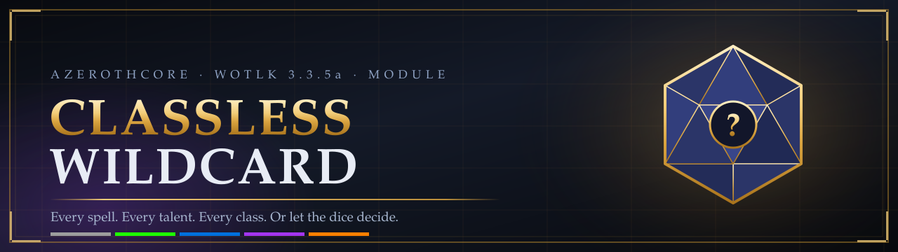

<div align="center">



<br>

[](https://www.azerothcore.org/)
[](https://www.azerothcore.org/)
[](src/)
[](client-addon/)
[](#license)

**Every character can learn every spell and every talent from every class** — buy them
with Essence like Ascension's classless realms, or let the dice decide in Wildcard mode.

[Install](#installation) · [How it plays](#two-ways-to-play) · [Commands](#commands) · [Configuration](#configuration) · [Uninstall](#uninstall)

</div>

---

> [!CAUTION]
> **This module is experimental.**
>
> The [client patch](#client-setup) is **required** — every player must run it, or the
> experience will be broken rather than merely unpolished.
>
> Installing changes character data and touches core tables. It is [reversible](#uninstall),
> but **back up your world and characters databases first** and don't install it on a realm
> where data loss would be a problem.

---

## Overview

`mod-classless-wildcard` is an AzerothCore module that removes the class system from WotLK.
Not "softened" — removed. Every character is a **Hero**: one shared base class under the
hood, so the class you pick at creation is cosmetic — it grants no abilities and locks
nothing away. Your race still brings its own racial traits; everything else — every ability
and talent — you earn yourself, from anywhere in the game.

Two progression paths ship in the box:

- **Classless** — an Essence economy. You pick exactly what you want, priced by rarity.
- **Wildcard** — Ascension's Season 9/10 ruleset. The server rolls for you on a fixed
  schedule; you steer the outcome with rerolls, ability locks and pity protection.

Players run a **one-click client setup** (included) that patches their 3.3.5a client and
installs the addon. It is part of the mod, not an extra — see [Client setup](#client-setup).

---

## Two ways to play

|                       | **Classless** (free-pick)                                      | **Wildcard** (rolled)                                                             |
| --------------------- | -------------------------------------------------------------- | --------------------------------------------------------------------------------- |
| How you gain power    | Spend Ability Essence (AE) and Talent Essence (TE)              | The server rolls abilities and talents for you                                     |
| Starting kit          | 9 AE to spend as you like                                       | 4 random abilities at level 1                                                      |
| Progression           | +1 AE and +1 TE per level from 10                               | 1 talent per level and 1 ability every 2 levels, from 10                           |
| Cost model            | Abilities cost 1 / 2 / 3 / 5 / 8 AE by rarity, talents 1 TE each | Free, but weighted — legendary is rarest, and talent rank *is* rarity             |
| Control over outcomes | Total; unlearn refunds, respec for gold                         | Rerolls, ability lock-in, synergy rolls, 25-roll bad-luck protection               |
| Changing your mind    | `.classless respec`                                             | `.wildcard reroll`, Reroll Scrolls, **Rebirth**                                |

Both paths share the universal resource pools, primary-stat allocation, full proficiency
training, the Hero Advancement NPC and the addon UI. Players choose a path per character
(or the realm forces one via config), and **Rebirth** lets them switch later for gold.

---

## Features

#### Progression

- **Classless free-pick** — rarity-priced abilities, and talents from every class tree that
  cost **one point each no matter which rank you take them to**, with prerequisites and tier
  rules enforced, refunds on unlearn, gold respec, and owned spell lines that auto-rank-up as
  you level.
- **Wildcard rolls** — the Ascension S10 schedule and mechanics: free rerolls below level 10,
  rarity-weighted rolls, the talent-upgrade-rolls-again rule, ability locking, and synergy rolls
  with a rising pity chance plus bad-luck bans.
- **Talent rank is its rarity** — a rolled talent lands on a random rank, and the rank *is* the
  tier: rank 1 common through **rank 5 legendary**. Since a talent costs one point whatever
  rank it arrives at, a high roll is four free ranks. (Rank odds follow `RarityWeights`, so the
  shipped equal-weight Season 9 default makes every rank equally likely — use descending
  weights like `100,60,30,10,3` to make rank 5 the rare prize.)
- **Rerolls flow with leveling.** Every scheduled roll grants a reroll charge — one pool,
  spent on abilities and talents alike — and anything you already own can be rerolled later
  from **My Build**. Reroll Scrolls are a single top-up item, good for either, for when charges
  run dry — bought from the Hero Advancement NPC, or straight from the addon's **Buy Scroll**
  button (the price scales with level — silver in the early game, gold near the cap;
  configurable, toggleable off).
- **Rebirth** — a config-gated full reset that switches a character between paths after the
  mode lock. Wildcard rebirths replay the entire roll schedule.

#### Making every build actually work

- **One base class for everyone** — every Hero shares a single base class (Paladin), so the
  class you pick at creation is purely cosmetic: it grants no class abilities and no build is
  locked to it. Race is the meaningful pick (it keeps its racial traits); everything else you
  can do comes from what you learn.
- **Universal resources** — every Hero carries mana, rage *and* energy at once. One shows on
  the main bar and the addon draws mini-bars for the rest (`/cwbars`). Every spell draws its
  own resource, so the same Hero casts Fireball on mana and Bloodthirsts on rage — no spell
  is ever unusable because of what it costs.
- **Primary stat allocation** — a per-level point budget spent freely across
  STR / AGI / STA / INT / SPI, applied live, reallocation free.
- **All proficiencies taught** — armor, weapons and dual wield, each configurable.
- **Optional item unlock** — one SQL script strips class restrictions from every item.

#### Getting players in the door

- **Hero Advancement NPC** (entry `990100`) — one in every major city, standing beside that
  city's guild master so it's easy to find (Shattrath's sits by A'dal). Each spawn carries the
  full gossip UI plus the scroll and item vendor, and everything it offers is also reachable
  from the addon panel. `.npc add 990100` places more anywhere.
- **Starter archetypes** — six curated builds (*Blade Dancer*, *Battle Mage*,
  *Ranger of the Light*, *Shadow Mender*, *Stealthy Healer*, *Storm Warrior*) that spend a new
  Hero's starting essence on a coherent role. Add your own in `cw_archetypes`.
- **First-login onboarding** — a welcome flow, plus an addon wizard that walks a fresh
  character through picking a path.
- **Classless item packs** — 28 Ascension-flavored items sold by the NPC, built around stat
  combinations the class system would never allow: intellect guns and wands with attack
  power, strength javelins and staves, mail tanking and caster gear, plate caster sets,
  spellpower fist weapons and shields, hybrid rings and necks. All server-side.
- **Hero heirlooms** — 23 items that **scale with you from level 1 to 80**, using the
  client's own heirloom system (no client patch needed). Weapons of every family plus
  "wrong armor" pieces the original classes could never wear: spellpower plate, strength
  mail, agility cloth, and single-stat trinkets for spellpower, haste and crit.

#### Client setup

Every player runs a **one-click installer** ([`client-patch/`](client-patch/README.md)): they
close WoW, double-click `install.bat` (or run `python3 install.py "/path/to/WoW"`), and their
client is set up. It needs nothing but Python 3 — no compiler, no MPQ tools, no manual file
copying — and `--uninstall` puts the client back to stock. It gives them:

- the **ClasslessWildcard addon**: the Hero Advancement panel — an ability browser, talent
  trees, your build with reroll and lock, the Wildcard roll UI, the onboarding wizard, and a
  built-in **Help** panel explaining both the Classless and Wildcard systems
- every class shown as **Hero** on the creation screen, character sheet, `/who` and tooltips
- a **single class per race** on the creation screen, described as the Hero
- the **Hero starter outfit** on the creation preview and a **Hero emblem** for your class icon

The creation-screen text is a signed game file, so the installer also applies the well-known
"allow custom interface" patch to `Wow.exe` (backed up first, reversed by `--uninstall`).

---

## Requirements

- An AzerothCore **master** build you can recompile — the module adds C++ sources.
- A **3.3.5a** client.
- Nothing else. No core edits, no other modules.

---

## Installation

**1. Clone into your modules directory**

```bash
git clone https://github.com/DustinHendrickson/mod-classless-wildcard.git azerothcore-wotlk/modules/mod-classless-wildcard
```

**2. Re-run CMake and rebuild the worldserver**

```bash
cmake .. && make -j$(nproc)
```

**3. Start the worldserver.** The SQL under `data/sql/db-world` and `data/sql/db-characters`
is applied automatically by the DB updater.

**4. Configure.** Copy `conf/classless_wildcard.conf.dist` next to your `worldserver.conf` as
`classless_wildcard.conf` (or let the build install it), then tune to taste.

**5. Set up every player's client.** Give players the `client-patch` and `client-addon`
folders and point them at [`client-patch/README.md`](client-patch/README.md): they close WoW,
double-click `install.bat` (or run `python3 install.py "/path/to/WoW"`), and they are done.
This is required — the mod expects a patched client.

<details>
<summary><b>Optional: unlock every item and every class quest</b></summary>

<br>

Both of these are **destructive** to core world tables, never auto-applied, and
back-uppable only by you "—" so they are opt-in. Back up the table first each time.

**Let Heroes take any class quest.** Apply `data/sql/manual/cw_class_quests.sql`
to your world DB by hand. It clears the class lock on every quest so a Hero can
pick up class quests from any class. Ability rewards are still blocked by the
module (`BlockOutsideSpellSources`), so no quest ever grants an ability "—" only
its item, XP, gold and reputation rewards. Back up `quest_template` first.

**Unlock every item for every class.** Apply
`data/sql/manual/cw_classless_items.sql` to your world DB by hand.

> **Back up `item_template` first.** This overwrites `AllowableClass` with `-1` for every item
> and the original masks cannot be recomputed. Players should clear their client `Cache`
> folder afterwards.
>
> ⚠️ **If you ran this module before September 2026:** this script used to live under
> `data/sql/db-world/optional/`, and AzerothCore's updater applies *everything* under
> `db-world` recursively — so it was applied automatically on your first startup, not
> optionally. Check with `SELECT * FROM acore_world.updates WHERE name = 'cw_classless_items.sql';`
> — if a row exists, your `item_template` was already overwritten and only a backup restores it.


</details>

---

## Commands

Everything the NPC and addon do is also available as a chat command.

### `.classless`

| Command                                           | What it does                                      |
| ------------------------------------------------- | ------------------------------------------------- |
| `.classless status`                               | Mode, essence balances, spent totals              |
| `.classless mode classless\|wildcard`              | Choose your path, before the deadline level       |
| `.classless learn <spellId>`                      | Buy an ability with Ability Essence               |
| `.classless unlearn <spellId>`                    | Drop an ability; refunds per config               |
| `.classless talent <talentId>`                    | Buy the next rank of a talent with Talent Essence |
| `.classless respec`                               | Full respec for gold                              |
| `.classless stats`                                | Show stat allocation and remaining points         |
| `.classless stat str\|agi\|sta\|int\|spi <points>` | Allocate points; reallocation is free             |
| `.classless bar mana\|rage\|energy\|default`       | Pick which resource the main power bar displays   |
| `.classless archetypes`                           | List starter archetypes and their IDs             |
| `.classless archetype <id>`                       | Apply a starter build to a fresh Hero             |
| `.classless rebirth classless\|wildcard`           | Full reset and path switch, costs gold            |

### `.wildcard`

| Command                                                             | What it does                                       |
| ------------------------------------------------------------------- | -------------------------------------------------- |
| `.wildcard status`                                                  | Pending rolls, reroll charges, pity counter        |
| `.wildcard reroll <spellId>`                                        | Reroll a rolled ability                            |
| `.wildcard rerolltalent <talentId>`                                 | Reroll a rolled talent                             |
| `.wildcard lock <spellId>`                                          | Lock an ability so future rolls can't replace it   |

### Addon slash commands

| Command               | What it does                            |
| --------------------- | --------------------------------------- |
| `/cw` or `/classless` | Open the Character Advancement panel    |
| `/cw help`            | Open the built-in guide to both systems |
| `/cwbars`             | Toggle the universal-resource mini-bars |

### Addon key bindings

The addon claims **`N`** — the stock Talents key — for the advancement panel the first
time it runs. Native talents are suppressed by this module, so that key otherwise opens a
dead frame; talents now live in the Hero Advancement panel instead. It only takes `N`
while it is still bound to the talent frame: if a player has rebound it themselves, the
addon leaves it alone and falls back to the first genuinely free key among `J`, `Y`, `G`,
`K`. All three actions live under **Key Bindings → ClasslessWildcard** and can be
rebound freely:

| Binding                    | Default        |
| -------------------------- | -------------- |
| Toggle Hero Advancement    | `N`            |
| Toggle the Help guide      | *(unbound)*    |
| Toggle the resource bars   | *(unbound)*    |

---

## Configuration

Every knob lives in [`conf/classless_wildcard.conf.dist`](conf/classless_wildcard.conf.dist),
which documents all 70+ settings inline. The ones you are most likely to touch:

| Setting                                             | Default     | Meaning                                               |
| --------------------------------------------------- | ----------- | ----------------------------------------------------- |
| `ClasslessWildcard.Enable`                          | `1`         | Master switch                                         |
| `ClasslessWildcard.DefaultMode`                     | `0`         | `0` classless, `1` wildcard                           |
| `ClasslessWildcard.AllowModeChoice`                 | `1`         | Let players pick; `0` forces `DefaultMode` realm-wide |
| `ClasslessWildcard.ModeChoiceDeadline`              | `5`         | Level after which the path locks                      |
| `ClasslessWildcard.IncludeDeathKnight`              | `0`         | Include DK spells — rune costs make these awkward     |
| `ClasslessWildcard.NpcEntry`                        | `990100`    | Hero Advancement NPC entry                            |
| `Chassis.Enable`                                    | `1`         | Force every character onto one class                  |
| `Chassis.Class`                                     | `2`         | Which class that is (2 = Paladin)                     |
| `Classless.StartingAbilityEssence`                  | `9`         | AE granted at character creation                      |
| `Classless.AbilityCostByRarity`                     | `1,2,3,5,8` | AE cost per rarity tier                               |
| `Classless.AbilityEssencePerLevel`                  | `1`         | AE per level from `EssenceStartLevel`                 |
| `Classless.TalentEssencePerLevel`                   | `1`         | TE per level                                          |
| `Classless.RespecCostGold`                          | `50`        | Gold cost of a full respec                            |
| `Wildcard.StartingAbilities`                        | `4`         | Abilities rolled at level 1                           |
| `Wildcard.RollStartLevel`                           | `10`        | Level the roll schedule begins                        |
| `Wildcard.TalentEveryLevels` / `AbilityEveryLevels` | `1` / `2`   | Roll cadence                                          |
| `Wildcard.RarityWeights`                            | `100,…`     | Roll weights per rarity tier — also picks talent rank |
| `Classless.TalentFlatCost`                          | `1`         | A talent costs 1 point at any rank                    |
| `Wildcard.FreeRerollBelowLevel`                     | `10`        | Rerolls are free under this level                     |
| `Wildcard.ScrollBuyEnable`                          | `1`          | Buy Scroll button on the addon panel                 |
| `Wildcard.ScrollBuyBaseCopper` / `…PerLevelCopper`  | `500` / `500`| Scroll price in copper = base + per-level × level    |
| `UniversalResources.Enable`                         | `1`         | Mana + rage + energy on every character               |
| `Stats.Enable` / `Stats.PointsPerLevel`             | `1` / `2`   | Primary stat allocation                               |
| `Rebirth.Enable` / `Rebirth.CostGold`               | `1` / `100` | Path switching after the mode lock                    |

### Per-spell and per-talent tuning

Rarity, cost, roll weight and an enable flag can be overridden for any individual spell or
talent through the `cw_ability_override` and `cw_talent_override` world tables — the way to
ban a problem ability, or make one legendary, without recompiling.

---

## Notes and limitations

These follow from the stock 3.3.5a client, and are not bugs:

- **The talent frame is unused.** Talents are granted as their underlying spells through the
  module, and native talent points are zeroed. Everything you learn shows in the spellbook.
- **Death Knight spells are excluded by default for now**

---

## Uninstall

The module is reversible. Almost everything it does is additive — its own tables, its own item
and NPC entries, runtime-only hooks — and the one large per-character change (cross-class
spells) cleans itself up on next login.

The exception is the class conversion: characters keep the chassis class after uninstalling,
since their original class was never stored. Restore a pre-install backup if you need it back.

<details>
<summary><b>Step-by-step revert</b></summary>

<br>

Do this **with the worldserver stopped**:

1. **Back up** your world and characters databases.
2. **Remove the code** — delete `modules/mod-classless-wildcard`, re-run CMake, rebuild the
   worldserver, delete `classless_wildcard.conf`.
3. **World DB** — run `data/sql/uninstall/cw_uninstall_world.sql` by hand; it is never
   auto-applied. It drops the module's world tables, the scrolls, the item pack, the NPC
   (template, spawns, vendor) and the custom `skillraceclassinfo_dbc` rows, and clears the
   module's DB-updater bookkeeping.
4. **Characters DB** — run `data/sql/uninstall/cw_uninstall_characters.sql`. It drops the
   `cw_char_*` state tables and removes the taught proficiency spells.
5. **Start the server.** The rest is automatic: with the custom skill-validity rows gone, the
   core's own login validation (`ValidateSkillLearnedBySpells`, on by default) deletes every
   spell and skill invalid for a character's real class the next time they log in. Talent
   points return and the power bar reverts to the class default.
6. **Client side** — players run `python3 install.py --uninstall "/path/to/WoW"`, which removes
   the patch archives and the addon, clears the cache, and restores `Wow.exe` if an older
   version had patched it (current versions never touch it).

**What does not revert automatically:**

- **The manual `manual/*.sql` scripts**, if you applied them, overwrote core world tables:
  `cw_classless_items.sql` set `item_template.AllowableClass` to `-1` for every item, and
  `cw_class_quests.sql` set `quest_template.AllowableClasses` to `0` for every quest. Neither
  original can be recomputed — restore those tables from your pre-install backup, or
  re-import them from the AzerothCore base SQL matching your core revision.
- **Same-class spells** a Hero was granted that are legal for its base class survive validation.
  Harmless; a GM can `.unlearn` them individually.
- Characters **created while the module was active** had their class starter spells and gear
  stripped and got the neutral Hero kit instead. After the revert they relearn missing spells at
  their class trainer as normal, and the kit items are ordinary vendorable items.
- Every Hero is effectively **respecced** when their granted kit disappears. That is inherent to
  removing a classless system — announce the revert to your players first.

Reinstalling later is safe: the uninstall scripts clear the DB-updater bookkeeping, so all module
SQL re-applies cleanly on the next startup.

</details>

---

## Contributing

Issues and pull requests are welcome. When reporting a bug, please include your AzerothCore
revision, the module commit, how your `classless_wildcard.conf` differs from the `.dist`, and
the worldserver log around the failure.

## License

GNU General Public License v2 or later, matching AzerothCore
(`acore.json` declares GPL2 and every core source header reads "version 2 of the
License, or (at your option) any later version"). Full text in [`LICENSE`](LICENSE).

## Credits

Mechanics are modeled on the published Season 9/10 rules of
[Project Ascension](https://ascension.gg/)'s classless and Wildcard realms. This project is
unaffiliated with Project Ascension and with Blizzard Entertainment.
