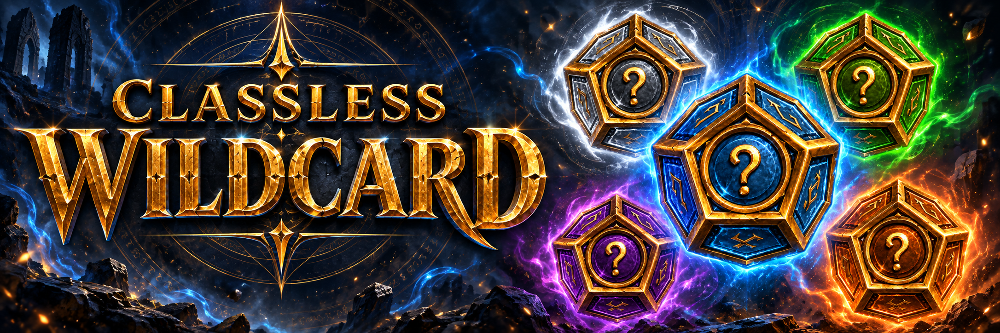
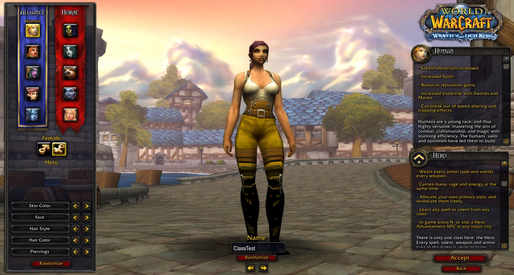
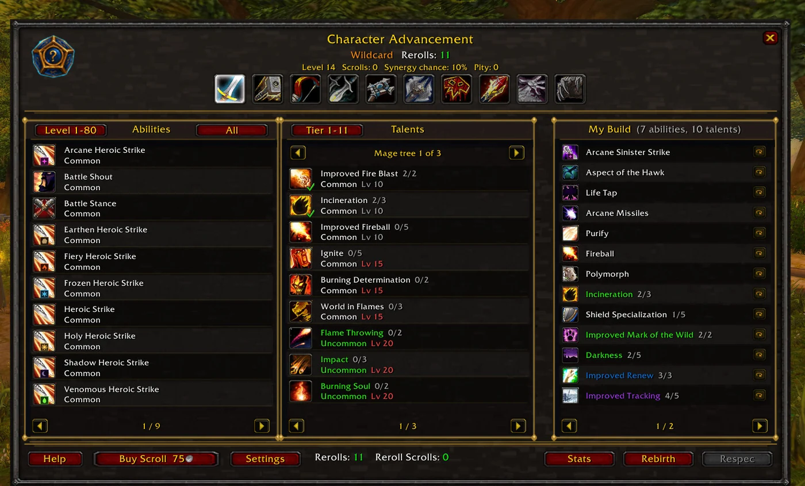
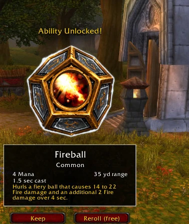
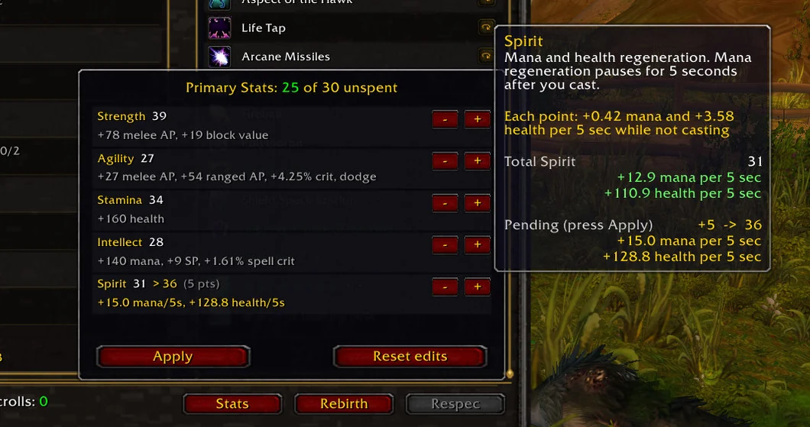
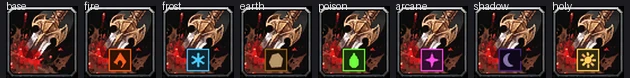

<div align="center">



<br>

[](https://www.azerothcore.org/)
[](https://www.azerothcore.org/)
[](src/)
[](client-addon/)
[](#license)

### An [AzerothCore](https://www.azerothcore.org/) module for WotLK 3.3.5a

**Every character can learn every spell and every talent from every class.** Buy them with
Essence, or let the server roll for you in Wildcard mode.

[Overview](#overview) · [Features](#features) · [Wildcard rolls](#wildcard-rolls) · [Challenge runs](#challenge-runs) · [Hero line](#the-hero-line) · [Elemental variants](#elemental-variants) · [Commands](#commands) · [Install](#installation) · [Configuration](#configuration) · [Uninstall](#uninstall)

<br>

I build these as free, open source AzerothCore modules, and they stay free. If this one is
useful to you, you can support the work:

[](https://buymeacoffee.com/dustinhendrickson)

</div>

---

> [!CAUTION]
> **A total server overhaul, and experimental.** It replaces the class system and rebuilds
> progression, resources, stats, gear and quest access around it. Build a realm around it; do
> not add it to one you care about.
>
> - **Every player must run the [client patch](#client-every-player).** Without it the game is broken for them.
> - **Back up your world and characters databases** before the first start. Install is [reversible](#uninstall).
> - **Close World of Warcraft before running the client patcher**, or it cannot clear the client cache.

---

## Overview

There are no classes. Character creation offers a race and nothing else, and every character is
a **Hero**. Race keeps its racial traits. Every ability and talent is earned in game and can come
from any class.

There are two paths, chosen per character (or forced realm-wide by config):

|                    | **Classless** (free pick)                                    | **Wildcard** (rolled)                                    |
| ------------------ | ------------------------------------------------------------ | -------------------------------------------------------- |
| How you gain power | Spend Ability Essence (AE) and Talent Essence (TE)           | The server rolls abilities and talents for you           |
| Level 1            | 3 AE to spend                                                | 4 random abilities                                       |
| Levelling          | +1 AE per level from 4, +1 TE per level from 10              | One roll per level from 10, alternating ability / talent |
| Cost               | Abilities 1 / 2 / 3 / 5 / 8 AE by rarity, talents 1 TE a rank | Free, weighted by rarity                                 |
| Changing your mind | Unlearn for a refund, or `.classless respec` for free        | Rerolls, Reroll Scrolls, ability locks                   |

Both paths share the same resources, stats, gear, NPC and addon.

---

## Screenshots

<div align="center">



<em><b>Character creation.</b> Pick a race. Every character gets all armour and weapons,<br>
every resource, and any spell in the game.</em>

<br><br>



<em>The <b>Hero Advancement</b> panel. Browse every class's abilities and talent trees,<br>
with your build on the right. Lock or reroll anything you own from the same window.</em>

<br><br>



<em>A <b>Wildcard</b> roll. Keep it, or spend a reroll.</em>

<br><br>



<em><b>Primary stats.</b> Spend points freely and reallocate for free.</em>

</div>

---

## Features

### Progression

- **Classless.** Buy abilities by rarity and talents a rank at a time. Prerequisites apply and
  each talent tier opens at its level, with no points-in-tree requirement. Unlearning refunds the
  essence. Owned spells rank up as you level.
- **Wildcard.** Rarity-weighted rolls, ability locks, and synergy rolls that favour classes you
  already own. See [Wildcard rolls](#wildcard-rolls).
- **Rerolls.** Free below level 10. From level 10, each level grants 3 reroll charges for
  abilities and talents. Anything you own can be rerolled from **My Build**. Reroll Scrolls add
  more. The NPC and the panel's Buy Scroll button sell them from level 10, at a price that rises
  with level.
- **Archetypes.** Thirteen Classless build templates from 1 to 80. Following one replaces your
  build, then buys each ability and talent rank with your essence as it unlocks. Stop any time
  and keep what was bought.
  - Two-class: *Blade Dancer*, *Battle Mage*, *Ranger of the Light*, *Shadow Mender*, *Thornshade*, *Storm Warrior*
  - Elemental: *Hellfire Knight*, *Rime Reaver*, *Stoneguard*, *Venomstalker*, *Nightclaw*, *Dawnward*, *Spellblade*
- **Change path.** A full reset at your current level, for gold. Classless Heroes move to the
  Wildcard; Wildcard Heroes move to Classless or take a fresh deal. A Wildcard deal replays the
  whole roll schedule.
- **Rebirth.** At the level cap, start over at level 1 with a permanent rank that stacks.
  - **Kept:** gold, bags, bank, reputation, riding, flight paths, and the **heirloom** abilities
    you choose to carry (usable from level 1, one more per rank).
  - **Reset:** your build and your quest log. Worn gear goes into your bags.
  - **Per rank:** +100% kill XP for the first, +50% per rank after (max +300%); +3%
    to every primary stat (max +15%); starting essence on the Classless path; a title (*the
    Reborn*, *the Twice Reborn*, *the Thrice Reborn*, *the Many-Lived*, *the Eternal*).
  - The gold price rises with rank. Start one from the panel's Rebirth button.
- **Challenge runs.** A life under one rule with limited lives. See [Challenge runs](#challenge-runs).

### Abilities and talents

- **Talents show in the talent frame** at the rank you own and are in your spellbook. They are
  paid for with Talent Essence, not talent points.
- **Talents that teach a spell** (Pyroblast, Mortal Strike, Mangle and so on) are in the
  Abilities list instead, with every rank, at the level their tier opens. Owning one counts for
  that talent's prerequisites.
- **Prerequisites come with the ability.** Cat Form brings Claw and Prowl, Charge brings Battle
  Stance, Kill Command brings a pet, Soul Shard spells bring Drain Soul. These are free, do not
  use a roll, and leave when nothing you own needs them.
- **No class tools.** Totem spells need no totem. Reagents are still needed. Runeforging still
  needs a runeforge.
- **Class passives come with their abilities.** Death Knight spells crit for double, Deep Freeze
  damages stun-immune targets, Flame Shock and Immolate can crit over time, and Chaos Bolt goes
  through absorbs.
- **Everything works together.** Any relic equips, shields work, Overpower, Revenge, Riposte and
  Counterattack all fire, feral attack power works in Cat and Bear form, and pets inherit your
  hit and expertise.
- **Tooltips count your talents.** Cost, cooldown, cast time, range, duration and values show what
  your build gives, including talents from other classes, and talent-reduced costs can be paid.
- **Summons leave with their spell.** Reroll Summon Imp away and the imp is dismissed. Reroll Tame
  Beast away and the beast is stabled; roll it again and the same beast returns.
- **The Hero line.** 33 abilities that belong to no class, and a 23-talent Hero tree. See
  [The Hero line](#the-hero-line).
- **Elemental variants.** 27 weapon attacks in seven elements. See
  [Elemental variants](#elemental-variants).

### Resources and stats

- **Mana, rage and energy on every Hero.** Each spell uses its own resource. One shows on the main
  bar; the addon draws mini-bars for the rest.
- **Runes and runic power** for every Hero while Death Knight abilities are enabled (the default).
- **Primary stat allocation.** Points to spend across STR, AGI, STA, INT and SPI, reallocated
  free at any time.
- **Stats work for any build.** Agility gives melee and ranged attack power, and Intellect gives
  spell power.

### Gear and items

- **Every proficiency at level 1.** All armour, all weapons, dual wield and Parry, with Shoot,
  Auto Shot and Throw. Weapon skills level by use.
- **Every item for every Hero.** Class armour sets, all 353 glyphs, rogue poisons, soul bags,
  quivers and relics. Sons of Hodir satchels give a random armour type.
- **Starter kit.** A neutral outfit, a bag, one of every basic weapon type with ammunition, and
  food and water.
- **Classless item catalogue.** 262 items with stat mixes no class had: intellect guns, strength
  staves, plate caster sets, spellpower shields, hybrid rings and more, levels 1 to 80. Sold by
  the NPC in level brackets and dropped by any mob near its level.
- **Hero heirlooms.** 23 items that scale from 1 to 80. Sold cheaply, and dropped by rares and
  world bosses.

### Granted for free

These are never rolled or bought. Every Hero receives them at these levels:

| Level | Riding                | Runeforging                                                   |
| ----- | --------------------- | ------------------------------------------------------------- |
| 20    | Apprentice Riding     |                                                               |
| 40    | Journeyman Riding     |                                                               |
| 55    |                       | Runeforging, Rune of Razorice, Rune of Cinderglacier          |
| 57    |                       | Rune of Spellshattering, Rune of Spellbreaking                |
| 60    | Expert Riding         | Rune of Lichbane                                              |
| 63    |                       | Rune of Swordshattering, Rune of Swordbreaking                |
| 68    | Cold Weather Flying   |                                                               |
| 70    | Artisan Riding        | Rune of the Fallen Crusader                                   |
| 72    |                       | Rune of the Stoneskin Gargoyle, Rune of the Nerubian Carapace |

Vendor, drop, reputation and quest mounts and companion pets work as normal. The five class mounts
(**Warhorse**, **Charger**, **Felsteed**, **Dreadsteed**, **Acherus Deathcharger**) are abilities,
rolled or bought at levels 20, 40 and 55.

### Quests

Every class quest chain is open to every Hero. A reward that would teach a class ability gives
nothing for that part; items, XP, gold and reputation are paid as normal.

### NPC and addon

- **Hero Advancement NPC.** In every capital, Dalaran and Shattrath. Advancement menu, gear
  vendor and Reroll Scrolls.
- **ClasslessWildcard addon.** The Hero Advancement panel (`N` by default), Wildcard roll UI,
  resource mini-bars, a first-login wizard and a Help guide. Everything it does is also a chat
  command.

### Known limits

- A wand fires as Physical rather than its own school. This only affects resistance.
- Other UI addons are not supported. Anything that reads class, spellbook, talent frames or power
  type may display wrongly or throw errors.

---

## Wildcard rolls

From level 10 you get one roll a level: an ability on even levels, a talent on odd ones.
`.wildcard status` shows your pity, synergy chance and cooldowns.

- **Rolls only add.** Each roll grants one thing you do not already own. Nothing is ever replaced.
- **What can roll.** Any ability you do not own whose learn level you have reached, weighted by
  rarity. If nothing is available at your level, the lowest-level remaining entries are used.
- **Synergy.** A synergy roll only offers entries sharing a class with something you own. The
  chance is 10%, plus 10 points per pity. Pity rises with each reroll and resets on a synergy roll
  or Rebirth.
- **Reroll cooldowns.** A rerolled pick cannot come back for the next 24 rolls. If everything is
  owned or on cooldown, the cooldowns are released.
- **Locks.** A padlocked ability is skipped by the starting hand's "Roll Abilities" button, which
  is available below level 10. Set padlocks from the starting hand, My Build, the NPC or
  `.wildcard lock`.
- **Talent ranks.** A talent roll also rolls its rank, and a fresh talent can land at any rank up
  to its top one. Higher ranks are rarer, weighted 100 / 75 / 50 / 25 / 10 for ranks 1 to 5.
- **Deepening a talent.** When rerolling a talent you can stake Reroll Scrolls to keep it and raise
  its rank instead. Each scroll adds 20% (five is certain). On a win the new rank can jump more
  than one; on a loss the scrolls are spent and the talent is rerolled as normal.

### Rarity

Rarity sets roll odds, Classless price and colour. It comes from the strongest of:

| Signal      | Uncommon | Rare  | Epic   | Legendary |
| ----------- | -------- | ----- | ------ | --------- |
| Cooldown    | 30 s     | 60 s  | 3 min  | 10 min    |
| Talent row  | 2        | 4     | 6      | 8         |
| Learn level | 25       | 50    |        |           |

Roughly 53% of abilities are common, 14% uncommon, 16% rare, 10% epic and 7% legendary. Fireball,
Backstab, Kick and Polymorph are common; Divine Shield, Ice Block, Mortal Strike and Bloodlust are
epic; Lay on Hands, Rebirth and the 41-point talents are legendary.

---

## Challenge runs

A run is one life under one rule, on either path. Start one from the Rebirth picker at the level
cap, or on a new Hero up to level 5.

- **Lives.** Each death costs one. Battlegrounds, arenas and duels are free. At zero, the run ends
  and you keep everything.
- **Finish** by reaching the level cap with a life left. Each challenge pays its gold, title and
  reward ability on the first finish. A repeat pays shards.
- **Flawless.** Finish without losing a life for the title *the Unbroken* and a third more shards.
- **Shards.** Paid when any run ends: one per level, two per level past 60. 30 shards buy an extra
  life for your next run.

| Challenge       | Lives | Rule                                                                                       | Gold | Title              | Reward           |
| --------------- | ----- | ------------------------------------------------------------------------------------------ | ---- | ------------------ | ---------------- |
| Nemesis         | 5     | Your killer gains five levels, becomes elite and grows. Kill it for bonus XP.             | 500  | the Nemesis        | Mark of the Nemesis |
| Elite World     | 5     | Enemies have triple health and double damage.                                              | 750  | Bane of Giants     | Giantsbane       |
| Legion          | 4     | Each enemy you engage calls two more.                                                      | 650  | the Legionbreaker  | One Against Many |
| Pursued         | 3     | Every 15 to 30 minutes, a hunter two levels above you tracks you until one of you dies.     | 600  | the Hunted         | Turnabout        |
| Hourglass       | 3     | Level up in time or lose a life: 20 min below 20, 30 min to 60, 45 min after.              | 500  | the Swift          | Rewind           |
| Glass           | 3     | Half health, a third more damage.                                                          | 400  | the Unshattered    | Shatterpoint     |
| Spiteful        | 3     | Enemies reflect a fifth of your damage.                                                    | 450  | the Scarred        | Spite Mirror     |
| Bloodpact       | 3     | Healing halved; every hit heals you for 15% of its damage.                                 | 450  | the Bloodthirsty   | Sanguine Pact    |
| Berserker       | 3     | Below 35% health: double damage, and your hits clear slows. Above 75%: 30% less damage.     | 450  | the Berserker      | Brink            |
| Ironman         | 3     | White and grey gear only.                                                                  | 500  | the Ironclad       | Ironbound        |
| Big Game Hunter | 3     | Normal enemies give no XP. Elites and bosses give full XP, quests give double.             | 400  | the Big Game Hunter | Trophy Hunt     |
| Hardcore        | 1     | One death ends the run.                                                                    | 1000 | the Deathless      | Last Breath      |

### Reward abilities

Granted as heirlooms: usable from level 1, kept through every Rebirth, never rerolled. They cannot
be rolled or bought.

| Ability             | What it does |
| ------------------- | ------------ |
| Mark of the Nemesis | Marked enemy takes 15% more damage from you. If it dies marked, you regain 20% health and mana and the mark jumps to the nearest enemy. |
| Giantsbane          | 120% weapon strike, +1% per 1% of max health the target has over you, up to double. |
| One Against Many    | 10 sec: 5% more damage dealt and 5% less taken per enemy within 10 yards, up to five. |
| Turnabout           | 8 sec: the next enemy to hit you is teleported behind, stunned for 4 sec, and takes 50% more damage from you while stunned. |
| Rewind              | After 6 sec, or on cancel, return to where you stood with the health, mana, rage and energy you had. |
| Shatterpoint        | Spend 30% of current health. The ice shard adds three times that, and shatters into enemies within 8 yards for half. |
| Spite Mirror        | 6 sec: a third of damage taken is returned as Shadow damage. |
| Sanguine Pact       | 10 sec: hits heal you for 30% of their damage. Overhealing becomes a shield up to 20% of max health. |
| Brink               | 8 sec: you cannot die, and deal 2% more damage per 1% missing health, up to double. |
| Ironbound           | 10 sec: armour equal to half your max health, and stun immunity. |
| Trophy Hunt         | Mark an elite, rare or boss. If it dies marked: 5% more damage and healing for 5 min, stacks three times. |
| Last Breath         | Passive. Once every 5 min a killing blow leaves you at 1 health, and for 6 sec your hits heal you for their full damage. |

---

## The Hero line

Thirty-three abilities that belong to no class, in their own **Hero** spellbook tab. Bought,
rolled and ranked like any other ability.

| Ability | What it does |
| ------- | ------------ |
| **Makeshift Strike** | Weapon strike that returns a little mana and rage |
| **Second Nature** | Restores a percentage of your mana, rage and energy |
| **Reclaimed Sentry** | A turret that fires on nearby enemies and strips armour |
| **Venom Beetle** | A pet that learns more poisons as you level. It has a pet bar and stays through logout |
| **Cairn**, **Waystone**, **Signal Fire**, **Rally Point** | Markers that help allies and hinder enemies near them |
| **Quickening** | Spends all your rage and energy for attack and casting speed |
| **Repertoire** | Rewards using a different ability each time |
| **Wildcard Surge** | Arcane damage that grows with your Epic and Legendary abilities |
| **Antipode Blast** | Fire and Frost in one cast, with a burn |
| **Hurl**, **Wide Arc**, **Crossdraw**, **Ricochet Shot** | A throw, a sweep, a spell-then-strike combo, and a bouncing shot |

### Hero talent tree

Twenty-three talents in four columns. Highlights:

| Talent | Effect |
| ------ | ------ |
| **Two Schools** | More damage when you hit in a different school from your last hit |
| **Jack of All Trades** | More damage and healing for every three classes you own an ability from |
| **Improvised Arsenal** | Makeshift Strike lowers Hurl's cooldown |
| **Field Repairs** | Second Nature and Adrenaline break snares and roots |
| **Last Reserve** | Ward Off refunds part of its cooldown when its shield is fully absorbed |
| **Opportunist** | Fistful of Grit, Vertigo and Sinkhole give energy per enemy caught |
| **Weave** | Every few Hero abilities, one is free while you keep casting them |
| **Field Study** | Emberfeed refunds part of its cost against a target bleeding from Bleed Over |
| **Venom Handler** | Your beetle's poison spreads from enemies that die with it |
| **Medicinal Venom** | Your beetle heals the most hurt party member |
| **Broad Strokes** | Overflow's spill always reaches you |
| **Overclocked** | Reclaimed Sentry fires twice as often |
| **Ricochet Chamber** | Ricochet Shot bounces again |

The rest improve placed markers (*Scavenger's Eye*, *Wider Net*, *Quick Deploy*), throws
(*Sharpened*, *Long Reach*) and resource costs (*Thrift*, *Overdraw*).

---

## Elemental variants

<div align="center">



<em>Left to right: the base attack, then Fire, Frost, Earth, Poison, Arcane, Shadow, Holy.</em>

</div>

Twenty-seven weapon attacks come in seven elemental forms each. A variant keeps its base's cost,
cooldown, combo points and ranks, and deals its damage as the element: armour does not reduce it,
resistance does, and bonuses to that school apply. It keeps 85% of the weapon damage (75% for
Holy) and adds an effect:

| | Element | Effect |
| :-: | ------- | ------ |
|  | Fire | Burns over 6 sec |
|  | Frost | 30% movement slow for 6 sec |
|  | Earth | 10% attack speed slow for 6 sec |
|  | Poison | Poisons over 12 sec |
|  | Arcane | An extra hit |
|  | Shadow | 20% healing reduction for 6 sec |
|  | Holy | Heals you for 25% of the damage dealt |

Fire, Poison, Arcane and Holy scale with spell power as well as attack power. Overpower, Maim and
Mangle, plus Shadow Mortal Strike and Shadow Aimed Shot, get an extra hit of their element instead
of its effect.

**Attacks with variants:** Sinister Strike, Backstab, Ambush, Hemorrhage, Heroic Strike, Cleave,
Whirlwind, Overpower, Mortal Strike, Devastate, Raptor Strike, Multi-Shot, Aimed Shot, Kill Shot,
Claw, Shred, Ravage, Maul, Maim, Swipe (Cat), Mangle (Cat), Mangle (Bear), Fan of Knives, and with
Death Knight abilities enabled, Blood Strike, Plague Strike, Obliterate and Death Strike.

Variants are one rarity above their base, roll less often, and file under the base attack's
spellbook tab. You can own a base attack and its variants together.

---

## Commands

### `.classless`

| Command | What it does |
| ------- | ------------ |
| `.classless status` | Path, owned abilities and talents, essence, reroll charges, cooldowns |
| `.classless mode classless\|wildcard` | Choose your path, before level 5 |
| `.classless learn <spellId>` | Buy an ability |
| `.classless unlearn <spellId>` | Drop an ability for a refund |
| `.classless talent <talentId>` | Buy the next rank of a talent |
| `.classless respec` | Unlearn everything, free, full refund |
| `.classless stats` | Show stat allocation and remaining points |
| `.classless stat str\|agi\|sta\|int\|spi <points>` | Allocate stat points |
| `.classless bar mana\|rage\|energy\|default` | Choose which resource the main bar shows |
| `.classless archetypes` | List archetypes and their IDs |
| `.classless archetype <id>` | Follow an archetype. `0` stops |
| `.classless path classless\|wildcard confirm` | Change path, for gold. Without `confirm`, says what it will do |
| `.classless rebirth classless\|wildcard [ability IDs] confirm` | Rebirth at the level cap, carrying the listed heirloom abilities |
| `.classless challenges` | List challenge runs |
| `.classless run <id> classless\|wildcard [ability IDs]` | Start a challenge run. At the level cap it is a Rebirth and needs `confirm` |

### `.wildcard`

| Command | What it does |
| ------- | ------------ |
| `.wildcard status` | Same as `.classless status` |
| `.wildcard reroll <spellId>` | Reroll an ability |
| `.wildcard rerolltalent <talentId> [scrolls]` | Reroll a talent, optionally staking scrolls to raise it instead |
| `.wildcard lock <spellId>` | Toggle an ability's padlock |

### Addon

| Command | What it does |
| ------- | ------------ |
| `/cw` or `/classless` | Open the Hero Advancement panel |
| `/cw help` | Open the guide |
| `/cwbars` | Toggle the resource mini-bars |
| `/cwbars show \| hide` | Show or hide the mini-bars |
| `/cwbars lock \| unlock` | Pin or unpin the mini-bars |
| `/cwbars reset` | Move the mini-bars back under the player frame |

The panel opens with `N`, or the first free key of `J`, `Y`, `G`, `K` if `N` is taken. Rebind
under **Key Bindings > ClasslessWildcard**. The panel's **Settings** button toggles each
mini-bar row.

---

## Installation

### Requirements

- An AzerothCore **master** build you can recompile. No core edits needed.
- A **3.3.5a** client for every player, with **Python 3.7+** for the installer.
- Optional: `mod-playerbots`, see [Playerbots](#playerbots).

### Server

1. Clone into `modules/`:

   ```bash
   git clone https://github.com/DustinHendrickson/mod-classless-wildcard.git azerothcore-wotlk/modules/mod-classless-wildcard
   ```

2. Re-run CMake and rebuild the worldserver.
3. Start the worldserver. The DB updater applies the module SQL. These two lines in the log are
   expected and mean the module's replacement scripts are in place:

   ```
   Script named 'spell_dru_frenzied_regeneration' is not assigned in the database.
   Script named 'spell_pal_judgement_of_wisdom_mana' is not assigned in the database.
   ```

4. Copy `conf/classless_wildcard.conf.dist` next to `worldserver.conf` as
   `classless_wildcard.conf` and edit it.

The SQL writes to core world tables (items, quests, creation info, creatures, vendors and the
spell and talent DBC tables). Original values are backed up first and restored by
[uninstall](#uninstall).

> If you installed before September 2026, run
> `SELECT * FROM acore_world.updates WHERE name = 'cw_classless_items.sql';`. If it returns a
> row, your `item_template` class masks have no backup and only your own backup restores them.

### Client (every player)

Give players the `client-patch` and `client-addon` folders. With WoW **closed**, they run
`install.bat` on Windows or `./install.sh "/path/to/WoW"` on Linux and macOS. See
[`client-patch/README.md`](client-patch/README.md).

It installs the addon, shows every class as **Hero**, replaces the class picker with one Hero
entry per race, adds names, tooltips and icons for the new spells and items, clears the client
cache, and patches `Wow.exe` to allow custom interface files (backed up first). Your original
game archives are not edited. `--uninstall` returns the client to stock.

Client and server must come from the same version of the module. After a server update, players
re-run the installer. If an item shows a question mark or a ranged weapon says "Out of range",
delete the `Cache` folder in the WoW directory and log back in.

### Playerbots

Bots keep their real class, abilities, talents and gear rules, and show as Hero. A bot is any
character on an account starting with a prefix in `ExemptAccountPrefixes` (default `rndbot`). If
your bot accounts use another prefix, add it, or the bots become Heroes and lose their abilities.

### Difficulty

Heroes are stronger than classes, and some combinations are much stronger. The module does not
change creature tuning. To make the world harder, raise creature rates in `worldserver.conf`:

```
Rate.Creature.Normal.HP                = 1.5
Rate.Creature.Normal.Damage            = 1.3
Rate.Creature.Normal.SpellDamage       = 1.3
Rate.Creature.Elite.Elite.HP           = 1.5
Rate.Creature.Elite.Elite.Damage       = 1.3
Rate.Creature.Elite.Elite.SpellDamage  = 1.3
```

The same rates exist for `RARE`, `RAREELITE` and `WORLDBOSS`. Raise damage along with health.

---

## Configuration

All settings are in [`conf/classless_wildcard.conf.dist`](conf/classless_wildcard.conf.dist),
documented inline and prefixed `ClasslessWildcard.`. The common ones:

| Setting | Default | Meaning |
| --- | --- | --- |
| **Paths** | | |
| `Enable` | `1` | Master switch |
| `DefaultMode` | `0` | `0` Classless, `1` Wildcard |
| `AllowModeChoice` | `1` | `0` forces `DefaultMode` for everyone |
| `ModeChoiceDeadline` | `5` | Level the path locks at |
| `Rebirth.Enable` / `Rebirth.CostGold` | `1` / `100` | Path change price; Rebirth costs this times (rank + 1) |
| `Rebirth.KillXpPctFirst` / `PerRank` / `Max` | `100` / `50` / `300` | Kill XP bonus per Rebirth rank, % |
| `Rebirth.OtherXpPctPerRank` / `Max` | `25` / `100` | Quest, exploration and battleground XP bonus per rank, % |
| `Rebirth.StatPctPerRank` / `Max` | `3` / `15` | Primary stat bonus per rank, % |
| `Rebirth.LegacyAbilityEssence` / `LegacyTalentEssence` | `3` / `2` | Starting essence per rank, Classless |
| **Pool** | | |
| `IncludeDeathKnight` | `1` | Death Knight abilities, talents and runes |
| `Forged.Enable` | `1` | The Hero line. Only turn off before anyone has one |
| `Elemental.Enable` | `1` | Elemental variants |
| `Elemental.RarityBump` | `1` | Rarity tiers above the base attack |
| `Elemental.RollWeightPct` | `8` | Roll weight, % of the base's |
| `Elemental.InPool` | `1` | `0` stops new variants being rolled or bought |
| `Elemental.ShowInBrowser` | `1` | Show variants in the addon and NPC |
| **Classless** | | |
| `Classless.StartingAbilityEssence` | `3` | AE at creation |
| `Classless.EssenceStartLevel` / `AbilityEssencePerLevel` | `4` / `1` | AE per level, from this level |
| `Classless.TalentEssenceStartLevel` / `TalentEssencePerLevel` | `10` / `1` | TE per level, from this level |
| `Classless.AbilityCostByRarity` | `1,2,3,5,8` | AE cost per rarity |
| `Classless.TalentFlatCost` | `0` | `1` charges rank 1 only |
| **Wildcard** | | |
| `Wildcard.StartingAbilities` | `4` | Abilities at level 1 (max 4) |
| `Wildcard.RollStartLevel` | `10` | First roll level |
| `Wildcard.AbilityEveryLevels` / `TalentEveryLevels` | `2` / `2` | Roll cadence |
| `Wildcard.RarityWeights` | `100,85,65,45,25` | Roll weight per rarity |
| `Wildcard.TalentRankWeights` | `100,75,50,25,10` | Roll weight per talent rank |
| `Wildcard.FreeRerollBelowLevel` | `10` | Rerolls are free below this level |
| `Wildcard.SynergyBanRolls` | `25` | Reroll cooldown, in rolls |
| `Wildcard.TalentUpgradePerScroll` | `20` | % per staked scroll |
| `Wildcard.ScrollBuyBaseCopper` / `ScrollBuyPerLevelCopper` | `500` / `500` | Scroll price: base + per level × level |
| **Resources, stats, gear** | | |
| `UniversalResources.MaxRage` / `MaxEnergy` | `1000` / `100` | Pool sizes |
| `UniversalStats.SpellPowerPerIntellect` | `0.5` | Spell power per Intellect |
| `UniversalStats.MeleeAPPerAgility` / `RangedAPPerAgility` | `1` / `1` | Attack power per Agility |
| `Stats.Enable` / `Stats.PointsPerLevel` | `1` / `2` | Stat allocation |
| `Riding.Enable` / `Riding.Grants` | `1` | Free riding, as `spell:level` pairs |
| `Runeforging.Enable` / `Runeforging.Grants` | `1` | Free runeforging, as `spell:level` pairs |
| `WorldDrops.Enable` / `Chance` | `1` / `1.0` | Classless gear drops, % per kill |
| `WorldDrops.RareMultiplier` | `5.0` | Drop multiplier for rares and bosses |
| `WorldDrops.HeirloomChance` | `2.0` | Heirloom %, rares and bosses only |
| `NpcEntry` | `990100` | Hero Advancement NPC entry |

Any spell or talent's rarity, cost, roll weight and availability can be overridden in the
`cw_ability_override` and `cw_talent_override` world tables. Restart after editing.

---

## Uninstall

Characters keep the Hero base class after uninstalling. Restore a pre-install backup to get their
original classes back.

<details>
<summary><b>Steps</b></summary>

<br>

With the worldserver stopped:

1. Back up the world and characters databases.
2. Delete `modules/mod-classless-wildcard` and `classless_wildcard.conf`, re-run CMake and rebuild.
3. Run `data/sql/uninstall/cw_uninstall_world.sql`.
4. Run `data/sql/uninstall/cw_uninstall_characters.sql`.
5. Start the server. On next login, each character loses spells and skills invalid for their
   class, and talent points return.
6. Players run the client installer with `--uninstall`.

**Left behind:**

- The Hero line and elemental variant rows in the spell tables. They are inert. To remove them,
  delete ids `950000`-`957167` and `960000`-`962047` from the spell tables, `9000`-`9022` from
  `talent_dbc`, `990` from `talenttab_dbc` and `skillline_dbc`, and `180`-`197` from
  `chartitles_dbc`.
- Spells legal for the base class. A GM can `.unlearn` them.
- Characters created under the module have no class starter spells; class trainers teach them.

Uninstalling removes every Hero's build. Tell your players first.

</details>

---

## Contributing

Issues and pull requests are welcome. With a bug report, include your AzerothCore revision, the
module commit, your `classless_wildcard.conf` changes, and the worldserver log around the failure.

## License

GNU General Public License v2 or later, matching AzerothCore. See [`LICENSE`](LICENSE).

## Credits

Mechanics are modeled on the Season 9/10 rules of [Project Ascension](https://ascension.gg/)'s
classless and Wildcard realms. This project is unaffiliated with Project Ascension and Blizzard
Entertainment.
